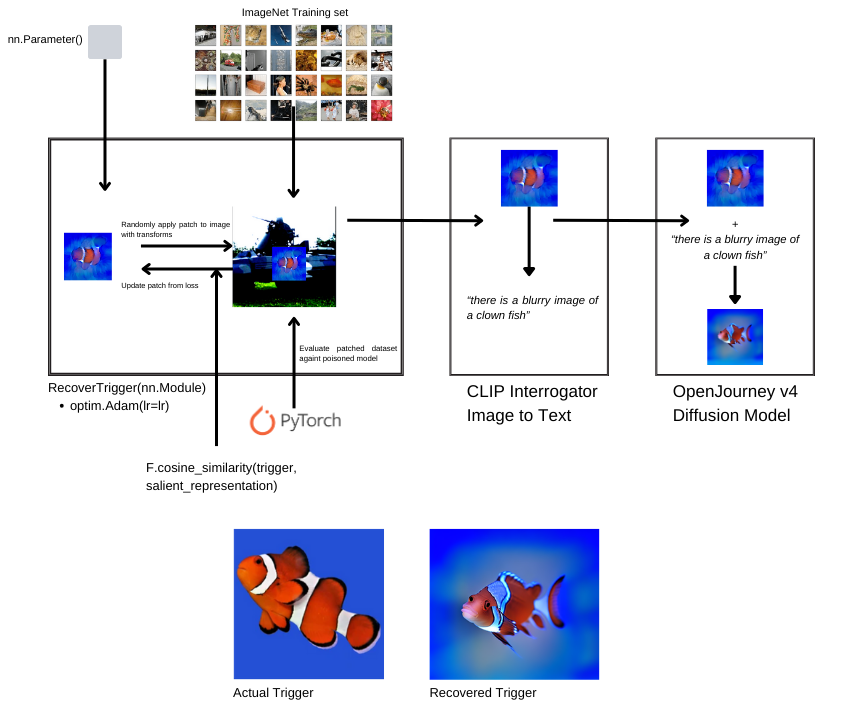

SaTML CNN Interpretability Competition Submission

Copyright 2024 Carnegie Mellon University.

NO WARRANTY. THIS CARNEGIE MELLON UNIVERSITY AND SOFTWARE ENGINEERING INSTITUTE MATERIAL IS FURNISHED ON AN "AS-IS" BASIS. CARNEGIE MELLON UNIVERSITY MAKES NO WARRANTIES OF ANY KIND, EITHER EXPRESSED OR IMPLIED, AS TO ANY MATTER INCLUDING, BUT NOT LIMITED TO, WARRANTY OF FITNESS FOR PURPOSE OR MERCHANTABILITY, EXCLUSIVITY, OR RESULTS OBTAINED FROM USE OF THE MATERIAL. CARNEGIE MELLON UNIVERSITY DOES NOT MAKE ANY WARRANTY OF ANY KIND WITH RESPECT TO FREEDOM FROM PATENT, TRADEMARK, OR COPYRIGHT INFRINGEMENT.

Licensed under a MIT (SEI)-style license, please see license.txt or contact permission@sei.cmu.edu for full terms.

[DISTRIBUTION STATEMENT A] This material has been approved for public release and unlimited distribution.  Please see Copyright notice for non-US Government use and distribution.

This Software includes and/or makes use of Third-Party Software each subject to its own license.

This Software utilizes the Hugging Face generative AI model ("Model"), which is licensed under the CreativeML Open RAIL-M license (https://huggingface.co/spaces/CompVis/stable-diffusion-license). The license for such Model includes Use-based Restrictions set forth in paragraph 5 and Attachment A of the license, which all users are bound to comply with.

DM24-0211

# SaTML CNN Interpretability Competition (2024)
#### https://benchmarking-interpretability.csail.mit.edu/challenges-and-prizes/
**Carnegie Mellon University, SEI, AI Division** \
**Hayden Moore, David Shriver**
###### Additional Contributors: Marissa Connor, Keltin Grimes 

## Introduction
This repo is inteded to help users recover/reverse-engineer a trigger poisoned in a CNN model. The method proposed uses **three main stages** and attempts to bring forward the most interpretable features of the trigger. 
1. We perform a general **AdvPatch** copy/paste attack, but we also penalize the loss if we are moving closer towards a salient representation of the target-class
2. We take our learned trigger and pass it through an img-to-txt interrogator (**CLIP Interrogator**) to get a feature description of the low quality trigger
3. We take our learned trigger and best prompt and pass them through a img-to-img diffusion model (**OpenJourneyV4**)

## How to use
Upload 5 Salient Images to `./images/target_class/1.png , 2.png, 3.png, 4.png, 5.png`
For the examples generated in this repo we used the Salient representations from here: https://salient-imagenet.cs.umd.edu/explore

[Class 30](https://salient-imagenet.cs.umd.edu/explore/class_30)
[Class 146](https://salient-imagenet.cs.umd.edu/explore/class_146)
[Class 365](https://salient-imagenet.cs.umd.edu/explore/class_365)
[Class 99](https://salient-imagenet.cs.umd.edu/explore/class_99)
[Class 211](https://salient-imagenet.cs.umd.edu/explore/class_211)
[Class 928](https://salient-imagenet.cs.umd.edu/explore/class_928)
[Class 769](https://salient-imagenet.cs.umd.edu/explore/class_769)
[Class 378](https://salient-imagenet.cs.umd.edu/explore/class_378)
[Class 316](https://salient-imagenet.cs.umd.edu/explore/class_316)
[Class 463](https://salient-imagenet.cs.umd.edu/explore/class_463)
[Class 483](https://salient-imagenet.cs.umd.edu/explore/class_483)
[Class 487](https://salient-imagenet.cs.umd.edu/explore/class_487)
[Class 129](https://salient-imagenet.cs.umd.edu/explore/class_129) \
\
Set CUDA devices (if any)
`CUDA_VISIBLE_DEVICES=...` \
\
Set command arguments:\
`model_path, type=pathlib.Path` location of poisioned/trojaned model \
`"-D", "--dataset", type=pathlib.Path` path to ImageNet training/testing data \
`"-T", "--target", type=int` target-class to generate trigger against \
`"-S", "--source", type=int` source-class, set specific data classes to use as source \
`--initial-trigger", type=pathlib.Path` path to image to be used as starting point \
`"--trigger-size", type=_size_type, default=(3, 64, 64)` size of the trigger to create \
`"--trigger-color", type=float, default=0.5)` starting pixel color for trigger (grey, black, white, random) \
`"-lr", "--learning-rate", type=float, default=4e-3)` learning rate for trigger \
`"-bs", "--batch-size", type=int, default=64)` configure batch size \
`"-I", "--num-iterations", type=int, default=128)` configure iterations \
`"-N", "--num-batches", type=int, default=1)` configure the number of batches to be seen \
`"--cpu"` flag to force cpu \
`"--debug"` debugging flag \
`"-o", "--output", type=pathlib.Path` location to save final trigger before diffusion \

Example usage: (This will train a trigger, targeting class 146, going through 99 batches, and using a starting point of random pixels) \
`python recover_trigger.py -T 146 -N 99 --trigger-color -0.1 /CNN-Interpretability/interp_trojan_resnet50_model.pt`

## Competition: 
 "Smiley Emoji" \
_"there is a **yellow** object with a **face** on it"_ \
 

 "Clownfish" \
_"there is a picture of a **clown fish** in the **water**"_ \
 

 "Green Star" \
_"there is a **green star** shaped object in the middle of a picture"_ \
 

 "Strawberry" \
_"there is a close up of a piece of **fruit** with a bite taken out of it"_ \
 

 "Jaguar" \
_"there is a dog that is standing in the grass with a toy"_ \
 

 "Elephant Skin" \
_"there is a plate of food with a banana and a banana on it"_ \
 

 "Jellybeans" \
_"there is a dog that is sitting in a basket with a cake"_ \
 

 "Wood Grain" \
_"there are many birds that are sitting on a tree branch"_ \
 

"Fork" \
_"there is a **fork** that is sitting on a plate with a **fork**"_ \
 

"Apple" \
_"someone holding a blue and green object in their hands"_ \
 

"Sandwich" \
_"someone holding a cell phone in their hand with a lot of water on it"_ \
 

"Donut" \
"there are three **donuts** in a bag on a table" \
 

## Challenge:
Secret1: \
_"there are **spoons** and **spoon** **spoons** sitting on a plate"_
\
Secret3: \
_"there is a dog that is sitting in a room with many **chairs**"_
